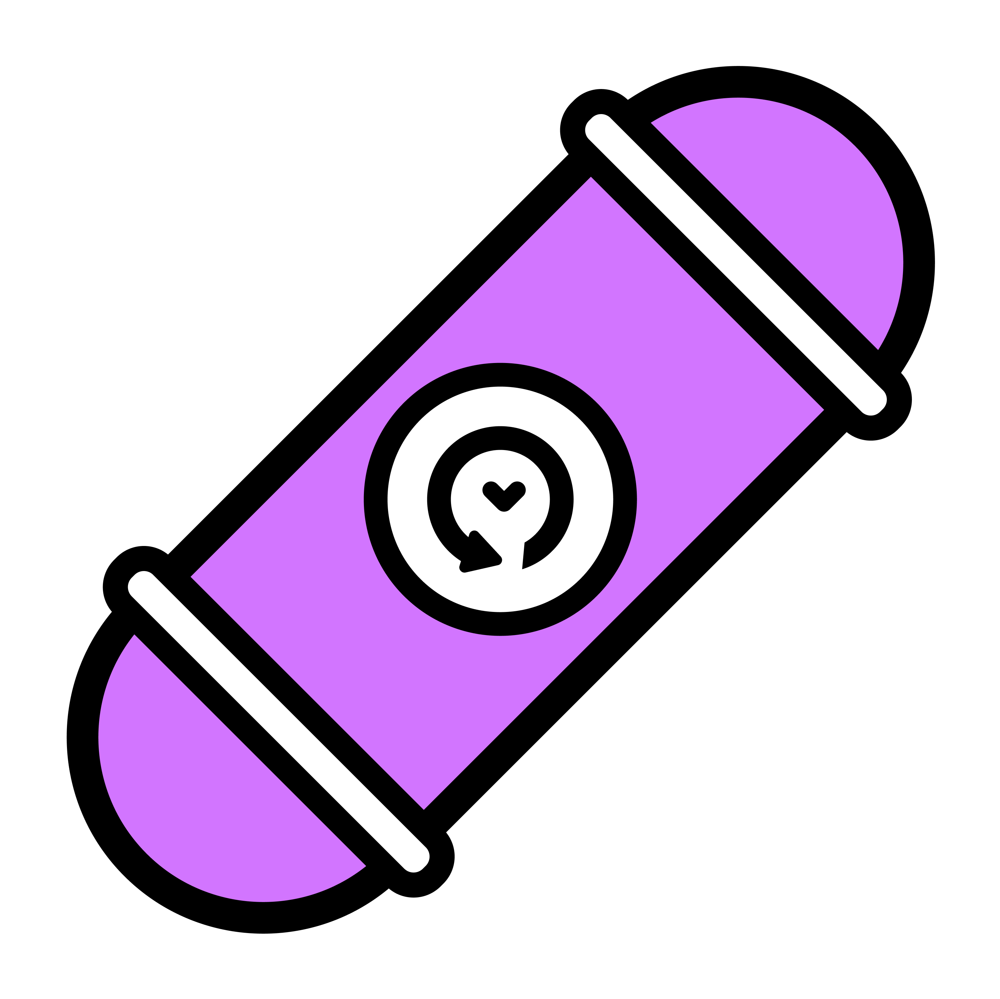

<!-- PROJECT SHIELDS -->
<!--
*** I'm using markdown "reference style" links for readability.
*** Reference links are enclosed in brackets [ ] instead of parentheses ( ).
*** See the bottom of this document for the declaration of the reference variables
*** for contributors-url, forks-url, etc. This is an optional, concise syntax you may use.
*** https://www.markdownguide.org/basic-syntax/#reference-style-links
-->
[![MIT License][license-shield]][license-url]
[![LinkedIn][linkedin-shield]][linkedin-url]

<!-- PROJECT LOGO -->
 

  

<h3 align="center">Capsy</h3>

  

    A virtual time capsule to remind yourselves of priceless memories. Create, wait, and open!
     
     
    <a href="https://github.com/alexandvo/capsy">View Demo</a>
  

<!-- TABLE OF CONTENTS -->

  
Table of Contents

  <ol>
    <li>
      <a href="#about-the-project">About The Project</a>
      <ul>
        <li><a href="#built-with">Built With</a></li>
      </ul>
    </li>
    <li>
      <a href="#getting-started">Getting Started</a>
      <ul>
        <li><a href="#prerequisites">Prerequisites</a></li>
        <li><a href="#installation">Installation</a></li>
      </ul>
    </li>
    <li><a href="#usage">Usage</a></li>
    <li><a href="#roadmap">Roadmap</a></li>
    <li><a href="#license">License</a></li>
    <li><a href="#contact">Contact</a></li>
  </ol>

<!-- ABOUT THE PROJECT -->
## About The Project

[![Capsy Screen Shot][product-screenshot]](https://alexandvo.github.io/capsy/)
[![Capsy Screen Shot][product-screenshot1]](https://alexandvo.github.io/capsy/)
[![Capsy Screen Shot][product-screenshot2]](https://alexandvo.github.io/capsy/)
[![Capsy Screen Shot][product-screenshot3]](https://alexandvo.github.io/capsy/)

(<a href="#readme-top">back to top</a>)

### Built With

* [![React][React.js]][React-url]
* [![Node][Node.js]][Node.js-url]
* [![Express][Express.js]][Express.js-url]
* [![Postgres][PostgreSQL]][PostgreSQL-url]
* [![fb][Firebase]][Firebase-url]

(<a href="#readme-top">back to top</a>)

<!-- GETTING STARTED -->
## Getting Started

Go to the website [here](https://alexandvo.github.io/capsy/), login/signup, and begin making your virtual time capsules!

<!-- USAGE EXAMPLES -->
## Usage

- Click the plus button to open up the form to create your capsule
- View all your capsules on the home page
- Get emailed when a capsule is ready to be opened
- Open your capsules when the date arrives to view your precious memories

(<a href="#readme-top">back to top</a>)

<!-- LICENSE -->
## License

Distributed under the MIT License. See `LICENSE.txt` for more information.

(<a href="#readme-top">back to top</a>)

<!-- CONTACT -->
## Contact

Alexander Vo - [@my_linkedin](https://www.linkedin.com/in/alexandvo) - alexthevo04@gmail.com

(<a href="#readme-top">back to top</a>)

<!-- MARKDOWN LINKS & IMAGES -->
<!-- https://www.markdownguide.org/basic-syntax/#reference-style-links -->
[contributors-shield]: https://img.shields.io/github/contributors/alexandvo/capsy.svg?style=for-the-badge
[contributors-url]: https://github.com/alexandvo/capsy/graphs/contributors
[forks-shield]: https://img.shields.io/github/forks/alexandvo/capsy.svg?style=for-the-badge
[forks-url]: https://github.com/alexandvo/capsy/network/members
[stars-shield]: https://img.shields.io/github/stars/alexandvo/capsy.svg?style=for-the-badge
[stars-url]: https://github.com/alexandvo/capsy/stargazers
[issues-shield]: https://img.shields.io/github/issues/alexandvo/capsy.svg?style=for-the-badge
[issues-url]: https://github.com/alexandvo/capsy/issues
[license-shield]: https://img.shields.io/badge/License-MIT-yellow.svg?style=for-the-badge
[license-url]: https://github.com/alexandvo/capsy/blob/master/LICENSE.txt
[linkedin-shield]: https://img.shields.io/badge/-LinkedIn-black.svg?style=for-the-badge&logo=linkedin&colorB=555
[linkedin-url]: https://linkedin.com/in/alexandvo
[product-screenshot]: images/capsy-screenshot.png
[product-screenshot1]: images/capsule-info-screenshot.png
[product-screenshot2]: images/capsule-info-openable.png
[product-screenshot3]: images/capsule-opened.png
[Next.js]: https://img.shields.io/badge/next.js-000000?style=for-the-badge&logo=nextdotjs&logoColor=white
[Next-url]: https://nextjs.org/
[React.js]: https://img.shields.io/badge/React-20232A?style=for-the-badge&logo=react
[React-url]: https://reactjs.org/
[Node.js]: https://img.shields.io/badge/Node.js-20232A?style=for-the-badge&logo=node.js
[Node.js-url]: https://nodejs.org/
[Express.js]: https://img.shields.io/badge/Express.js-20232A?style=for-the-badge&logo=express
[Express.js-url]: https://expressjs.com/
[PostgreSQL]: https://img.shields.io/badge/PostgreSQL-20232A?style=for-the-badge&logo=postgresql
[PostgreSQL-url]: https://www.postgresql.org/
[Firebase]: https://img.shields.io/badge/Firebase-20232A?style=for-the-badge&logo=firebase
[Firebase-url]: https://firebase.com/
[Vue.js]: https://img.shields.io/badge/Vue.js-35495E?style=for-the-badge&logo=vuedotjs&logoColor=4FC08D
[Vue-url]: https://vuejs.org/
[Angular.io]: https://img.shields.io/badge/Angular-DD0031?style=for-the-badge&logo=angular&logoColor=white
[Angular-url]: https://angular.io/
[Svelte.dev]: https://img.shields.io/badge/Svelte-4A4A55?style=for-the-badge&logo=svelte&logoColor=FF3E00
[Svelte-url]: https://svelte.dev/
[Laravel.com]: https://img.shields.io/badge/Laravel-FF2D20?style=for-the-badge&logo=laravel&logoColor=white
[Laravel-url]: https://laravel.com
[Bootstrap.com]: https://img.shields.io/badge/Bootstrap-563D7C?style=for-the-badge&logo=bootstrap&logoColor=white
[Bootstrap-url]: https://getbootstrap.com
[JQuery.com]: https://img.shields.io/badge/jQuery-0769AD?style=for-the-badge&logo=jquery&logoColor=white
[JQuery-url]: https://jquery.com 
